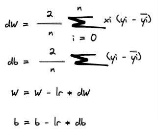

# ML - Engineering Challenge

## Build a machine learning system

Welcome to the endeavour machine learning challenge! This challenge is designed to test a large variety of skills that a machine learning engineer would use in their day to day work. There are no restrictions in terms of technology required for this challenge other than the use of Python 3. You are free to use whichever technology or cloud provider you like. It's important to note that everyone has strong points and weak points. If you are strong in one or more areas, try to make that area shine. 

The challenge description is as follows:

#### 0. Take the code provided and upload it to a git repository of your choice. 
After you complete the challenge, please add our team members as viewers to your repo.

#### 1. Please provide a high level overview of your systems design and its key components. 
This could be a one pager, a readme.md or an architecture diagram. We will leave the implementation up to you. 

#### 2. Create a simple linear regression model. 
You will have to fill in the gaps in the `SimpleLinearRegression` class so that the code will run successfully.
   
The following functions need to be filled:

-  `__loss`: This function defines the loss function of your choice.
-  `__sgd`: We will use the Stochastic Gradient Descent Algorithm to optimise the slope and the intercept of our linear function. There are many resources online about SGD, However
the most important formulas are :
    

Where `n`is the number of sample in the training dataset. 

Do your best to vectorize the formulas.

-  `__predict`our linear function to predict the outcome. The function of a simple line is defined as `y= wX + b`

We have provided the benchmark code `benchmark.py`. Execute it and you should get the Coefficient of determination around `0.42`.
A good implementation should return about the same Coefficient of determination or slightly higher. During the interview we could explore the time and memory complexity of your code. 

**PS: If you are struggling implementing the above, consider using scikit-learn to progress to the next stages (but this is not encouraged).**

3. Update `main.py` to make it an API for inference. Make the API invokable from a http request. The choice of web framework is up to you. 

The API should have two endpoints:
- `POST /stream` : which takes a payload of one record and return the prediction for that record.
- `POST /batch` : which takes an array of multiple records and return an array of predictions

Think about what other features an enterprise machine learning system would have. 

#### 4. Package your code into a python package to make it easily installable and testable for developers. 

#### 5. Package your code into a container and deploy it to a container registry of your choice.
   
#### 6. Create a CICD pipeline using the technology of your choice to deploy your code to production. 
Think about what stages might be required in a full CICD pipeline. Your code should be invokable from a public URL.

#### 7. Document what componenets an enterprise machine learning system would have if you had the time to add it. 
What are some things that are critical to have versus nice to have?

## Assessment Criterion

We are not looking for a highly performant model. The criterion for this exercise is centered on a complete system that works well together and your ability to apply a machine learning inference to a real world use case. The following diagram speaks volumes about the reality of a machine learning engineer.

We are more interested in how your overall system works and the ancillary systems and components that are considered and better yet, implemented. As you complete the challenge, try to think about the following assessment criterion:

- Does your solution work end to end?
- Are there any unit tests or integration tests?
- Has security/monitoring been considered? 
- How is your solution documented? Is it easy to build on and for other developers to understand
- How performant is your solution both from a code perspective and a scalability perspective as a service
- Has due consideration been given to what a production ML system would require? This could be interactions or dependencies with other systems.

Good luck & have fun! 

