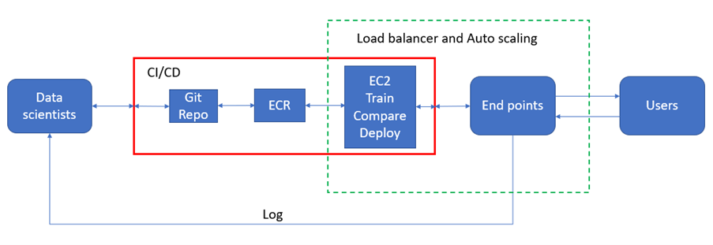

# ML - Engineering Challenge Solved

## Build a machine learning system

A machine learning system has been built which includes following components and operations (as depicted in below diagram) :
1. Data scientists/ML engineers develop or make adjustment/s to the codes and push them to this Github repository.
2. The Github takes action to achieve continuous integration of the codes (an unit test will be carried out to verify the integration).
3. A docker image will be built and pushed to an Elastic container repository on AWS cloud.
4. The docker image then will run on a EC2 instance server where the training of the model (train.py) occurs. The results of the training will be compared with those of the old model and if the new model is better it will replace the previous one.
5. The model will be deployed to obtain endpoints which can be used by users to get inference.
6. The data scientists/ ML engineers can use an endpoint to obtain the log of the system for a monitoring purpose.
7. A Load balancer and auto scaling can be added to solve the traffic congestion (if I have time, I'll add these features since this is critical to have). Moreover, a monitoring system from AWS can be utilised as well.

    

Notes: 1. For a production ML system, S3 bucket to store model's artifacts, features and data should be applied. The MLOps pipeline can also been built in AWS Sagemaker with more advanced features and assistance.
2. To monitor the workflows, go to Actions on this repository.

## Implementation
The script test.py can be utilised to do the inference and history logging.

The API have three endpoints:
- `POST /stream` : which takes a payload of one record and return the prediction for that record.
- `POST /batch` : which takes an array of multiple records and return an array of predictions.
- `GET /log` : which retrieve the log history of the system that can be used to monitor the system's performance.
- `GET /emptyLog` : which empties the log history of the system to free occupied storage by the log file.

